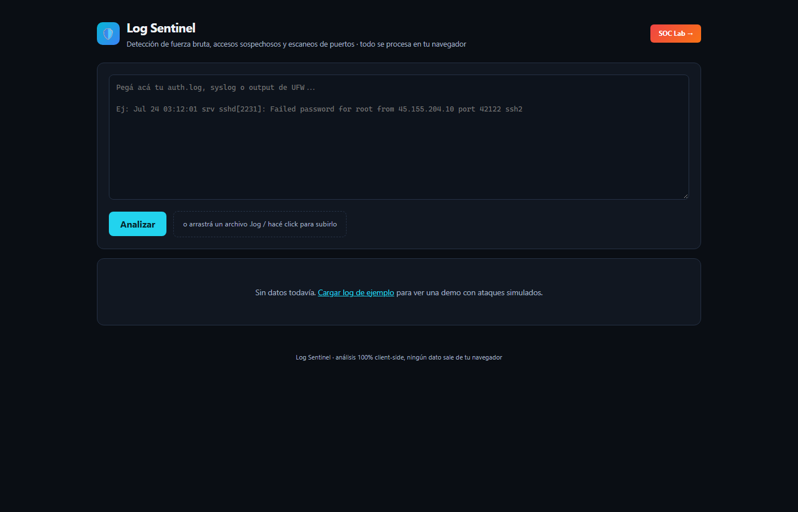
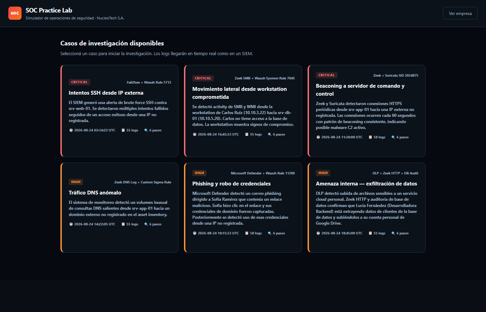

# Log Sentinel

Analizador de logs y simulador de triage para analistas SOC de nivel 1. Todo corre en el navegador: ningún log sale de tu equipo.

**Demo online:** https://log-sentinel-seven.vercel.app

El proyecto tiene dos partes:

1. **Analizador de logs** (`/`): pegás o subís un `auth.log`, syslog o salida de UFW y detecta fuerza bruta, accesos sospechosos y escaneos de puertos.
2. **SOC Practice Lab** (`/soc`): 6 casos de investigación con logs que llegan en tiempo real como en un SIEM. Hay que triagear, consultar el playbook, clasificar la alerta y redactar el reporte.





---

## Analizador de logs

El parser (`lib/parser.ts`) normaliza cada línea (timestamp syslog o ISO, IP, usuario, puerto) y aplica estas reglas de detección:

| Detección | Lógica | Severidad | MITRE ATT&CK |
|-----------|--------|-----------|--------------|
| Fuerza bruta | 5 o más autenticaciones fallidas desde la misma IP | High (Critical desde 20) | T1110 Brute Force |
| Acceso exitoso tras fallos | Login aceptado desde una IP con fallos previos | Critical | T1078 Valid Accounts |
| Escaneo de puertos | Una IP contacta 8 o más puertos distintos (logs de kernel/UFW) | Medium | T1046 Network Service Discovery |
| Ruido externo | De 3 a 4 fallos desde IPs públicas | Low | — |

Las alertas se ordenan por severidad e incluyen la IP, el conteo y una recomendación de respuesta. Con **Cargar log de ejemplo** podés ver una demo con ataques simulados.

**Formatos soportados:** `sshd` (Failed/Accepted password, invalid user, publickey), `pam` (authentication failure) y logs de firewall con `DPT=`/`port=`.

## SOC Practice Lab

Simula el turno de un analista L1 en **NucleoTech S.A.**, una fintech ficticia con empleados, servidores, VLANs, rangos de red y playbooks propios (`lib/company.ts`). El panel **Ver empresa** sirve como inventario de activos para decidir si una IP es interna, externa o de VPN.

| Caso | Fuente de la alerta | Severidad | Técnica MITRE |
|------|---------------------|-----------|---------------|
| Intentos SSH desde IP externa | Fail2ban + Wazuh Rule 5712 | Critical | T1110.001 |
| Movimiento lateral desde workstation comprometida | Zeek SMB + Wazuh Sysmon Rule 7045 | Critical | T1021.002 |
| Beaconing a servidor de comando y control | Zeek + Suricata SID 2024875 | Critical | T1071.001 |
| Tráfico DNS anómalo | Zeek DNS Log + regla Sigma | High | T1071.004 / T1048 |
| Phishing y robo de credenciales | Microsoft Defender + Wazuh Rule 11200 | High | T1566 / T1078 |
| Amenaza interna: exfiltración de datos | DLP + Zeek HTTP + DB Audit | High | T1567.002 |

Cada caso trae entre 55 y 58 líneas de log y sigue el flujo real de un ticket L1 en 6 pasos:

1. Identificar los logs relevantes
2. Asignar el incidente
3. Consultar el playbook
4. Clasificar: falso positivo o positivo verdadero
5. Redactar el reporte
6. Volver al panel

Cada decisión incorrecta muestra su consecuencia y la explicación, así que funciona como entrenamiento guiado.

---

## Correr localmente

```bash
git clone https://github.com/vandallco/log-sentinel.git
cd log-sentinel
npm install
npm run dev
# http://localhost:3000
```

## Stack

Next.js 15 (App Router), React 19 y TypeScript. No usa backend ni base de datos: el análisis es 100% client-side.

## Estructura

```
app/
├── page.tsx              # Analizador de logs
└── soc/                  # SOC Practice Lab
    ├── page.tsx
    └── components/       # Dashboard, LogPanel, StepCard, CompanyPanel...
lib/
├── parser.ts             # Parser y reglas de detección
├── company.ts            # Empresa ficticia: activos, red y playbooks
└── scenarios/            # 6 casos de investigación
```

## Roadmap

- [ ] Exportar alertas a JSON/CSV para importarlas en un SIEM
- [ ] Soporte para Windows Event Logs (4625/4624) y logs de Apache/Nginx
- [ ] Puntaje por caso y tiempo de resolución (MTTR) del analista

## Autor

Benjamín Tito Vincenti: [LinkedIn](https://www.linkedin.com/in/benjam%C3%ADn-tito-vincenti-1002b4324/) · [GitHub](https://github.com/vandallco)
